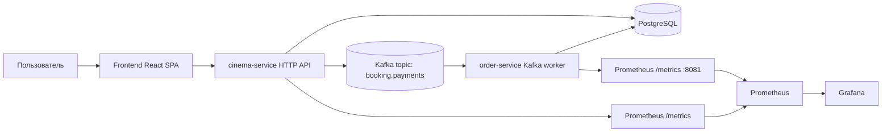
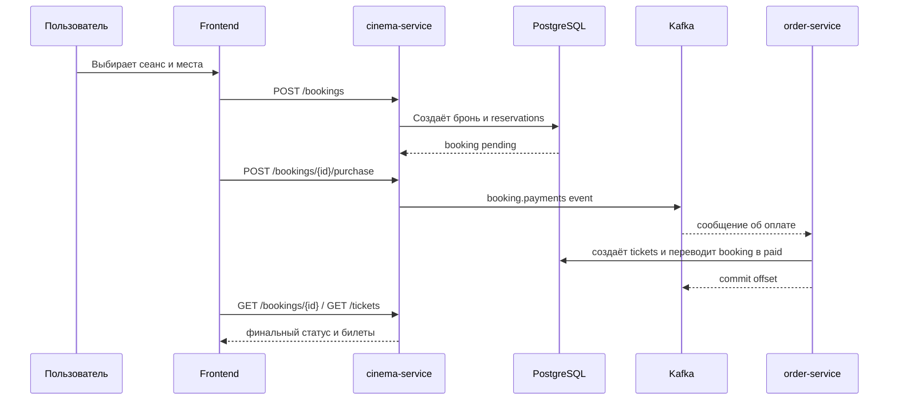

# Отчёт: go_cinema_system

## 1. Назначение сервиса

`go_cinema_system` — это платформа для онлайн-продажи билетов в кинотеатр. Сервис позволяет просматривать фильмы, кинотеатры, залы и сеансы, бронировать места, оплачивать брони через Kafka-поток и получать билеты после завершения обработки заказа.

Проект состоит из двух Go-процессов и отдельного фронтенда:

- `cinema-service` — основной HTTP API для каталога, бронирований, авторизации и выдачи билетов.
- `order-service` — Kafka worker, который завершает покупку по событию оплаты и создаёт билеты.
- `frontend` — SPA-клиент на React для пользовательского сценария покупки и просмотра заказов.

## 2. Высокоуровневая архитектура

Архитектура построена вокруг PostgreSQL как единого источника данных и Kafka как шины событий для асинхронной обработки покупки.

### Ключевая идея

Сценарий покупки разделён на два этапа:

1. HTTP API создаёт бронирование и удерживает места.
2. При нажатии на покупку событие отправляется в Kafka.
3. Worker читает событие, создаёт билеты и переводит бронь в `paid`.

Это уменьшает связность между веб-слоем и финализацией оплаты, а также позволяет отдельно масштабировать обработчик заказов.

## 3. Слои backend

Проект организован по слоистой схеме:

- `cmd/*` — точки входа для отдельных процессов.
- `internal/cinema` — домен кинотеатра: модели, интерфейсы, usecase, repository и HTTP transport.
- `internal/order` — домен обработки оплаты и билетов.
- `internal/platform` — общие инфраструктурные компоненты: конфигурация, PostgreSQL, Kafka, JWT, парольная безопасность и метрики.

### Основные зависимости между слоями

- `transport/http` принимает запросы и делегирует работу `usecase`.
- `usecase` содержит бизнес-правила и валидацию.
- `repository` работает с PostgreSQL через `sqlx`.
- `platform/kafka` публикует событие оплаты.
- `order-service` потребляет Kafka-сообщение и вызывает свой usecase.

## 4. Основные компоненты

### 4.1 cinema-service

Точка входа находится в [cmd/cinema-service/main.go](../cmd/cinema-service/main.go). При старте сервис:

- загружает конфигурацию из `.env` и переменных окружения;
- создаёт JWT manager;
- подключается к PostgreSQL;
- создаёт Kafka publisher;
- при необходимости загружает seed-данные;
- инициализирует бизнес- и Kafka-метрики;
- поднимает HTTP сервер и graceful shutdown.

### 4.2 order-service

Точка входа находится в [cmd/order-service/main.go](../cmd/order-service/main.go). При старте воркер:

- загружает worker-конфигурацию;
- подключается к PostgreSQL;
- инициализирует Prometheus-метрики;
- поднимает отдельный metrics HTTP server на `:8081`;
- запускает Kafka consumer loop.

### 4.3 Kafka worker

Worker читает сообщения из topic `booking.payments`, декодирует событие `PaymentRequestedEvent` и вызывает бизнес-логику покупки. Если бронирование уже обработано или не найдено, сообщение пропускается без падения процесса.

## 5. Доменные сущности и данные

Модель данных описана в [db.dbml](../db.dbml) и реализуется через PostgreSQL.

### Основные таблицы

- `cinemas` — кинотеатры.
- `halls` — залы внутри кинотеатров.
- `seats` — места в залах.
- `movies` — фильмы.
- `sessions` — сеансы показа.
- `users` — пользователи.
- `bookings` — бронирования.
- `tickets` — билеты.
- `reservations` — временные удержания мест до оплаты.
- `test_messages` — вспомогательная таблица для тестовых эндпоинтов.

### Бизнес-логика данных

- Бронь создаётся в статусе `pending`.
- Места удерживаются через `reservations` на 15 минут.
- После оплаты создаются `tickets`, а бронь получает статус `paid`.
- При отмене оплаченной брони билеты переводятся в `deactivated`, а зарезервированные места освобождаются.
- Просроченные билеты переводятся в `used` при чтении списка билетов.

## 6. Функциональность backend

### Каталог

- просмотр списка фильмов и фильма по ID;
- просмотр списка кинотеатров и кинотеатра по ID;
- просмотр залов, мест и сеансов;
- создание, обновление и удаление фильмов;
- создание кинотеатров и сеансов.

### Аутентификация и пользователи

- регистрация пользователя с хешированием пароля через bcrypt;
- логин с выдачей JWT;
- получение профиля текущего пользователя;
- список пользователей.

### Бронирования и оплата

- создание брони на набор мест;
- проверка занятости мест на уровне транзакции;
- публикация события оплаты в Kafka;
- отмена бронирования;
- просмотр своих бронирований.

### Билеты

- просмотр всех билетов текущего пользователя;
- просмотр конкретного билета;
- автоматическое обновление статуса просроченных билетов.

### Технические и диагностические endpoints

- `GET /health` — проверка здоровья;
- `GET /metrics` — Prometheus metrics;
- `GET /test`, `GET /slow`, `POST /dbtest` — тестовые endpoints для проверки инфраструктуры.

## 7. Поток покупки

## 8. Используемые библиотеки

### Backend Go

- `github.com/go-chi/chi/v5` — HTTP роутинг.
- `github.com/jmoiron/sqlx` — работа с PostgreSQL.
- `github.com/lib/pq` — драйвер PostgreSQL.
- `github.com/golang-jwt/jwt/v5` — JWT токены.
- `golang.org/x/crypto/bcrypt` — хеширование паролей.
- `github.com/segmentio/kafka-go` — Kafka producer/consumer.
- `github.com/prometheus/client_golang` — метрики и экспорт `/metrics`.
- `github.com/joho/godotenv` — загрузка `.env`.

### Frontend

- `react` и `react-dom` — UI.
- `react-router-dom` — маршрутизация.
- `@tanstack/react-query` — серверный state, кэш и мутации.
- `axios` — HTTP client.
- `date-fns` — форматирование дат.
- `vite` — dev server и сборка.
- `tailwindcss` — стилизация интерфейса.
- `typescript` — типизация.

## 9. Frontend

Frontend — это SPA на React, которое повторяет основные пользовательские сценарии:

- главная страница с витриной фильмов;
- список кинотеатров и их карточки;
- страница фильма и сеансов;
- экран выбора мест для бронирования;
- подтверждение покупки и отмены;
- список заказов и список билетов;
- профиль пользователя.

Роутинг описан в [frontend/src/App.tsx](../frontend/src/App.tsx). Авторизационное состояние хранится в localStorage и обёрнуто в React Context.

## 10. Инфраструктура запуска

Проект рассчитан на запуск через `docker compose`.

В `docker-compose.yml` поднимаются:

- PostgreSQL 16;
- Kafka и Zookeeper;
- Kafka UI;
- `cinema-service`;
- `order-service`;
- Prometheus;
- Grafana.

Автозаполнение БД выполняется из `deployment/db/init` при первом старте пустого volume.

## 11. Что делает сервис в целом

Если описать проект коротко, это полноценная билетная платформа для кинотеатра с разделением на API и фоновую обработку оплаты. Пользователь может выбрать фильм, зал и места, создать бронь, оплатить её, получить билеты и позже отследить их статус. Для операционной части предусмотрены метрики, дашборды и контейнеризированный запуск всей системы.
